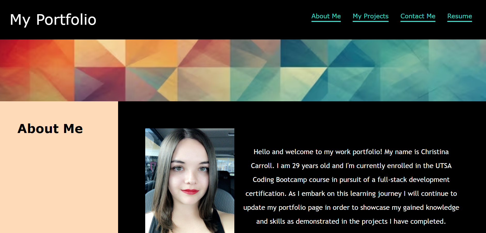

**Project Title:** Module 2 Challenge - Creating a Portfolio Webpage

**Description:** In this project I created a portfolio webpage so potential employers can easily view my completed projects and deployed applications. I will continue to update my porfolio with new projects as they are completed throughout the course. My goal is for the website to be interactive and easily navigated by utilizing navigation links to different sections on the page, image links to my deployed applications, and ensuring the layout is responsive and adapts to various screen sizes and devices. 

**Link to Deployed Application:** https://ccarroll929.github.io/portfolio-webpage/

**Installation:** [VS Code](https://code.visualstudio.com/download)
                  [Git for Windows](https://gitforwindows.org/)  
